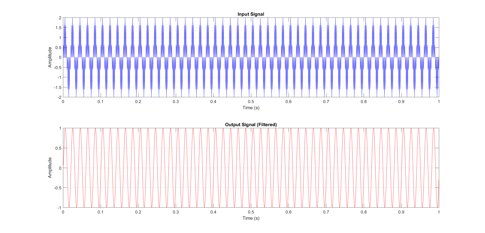
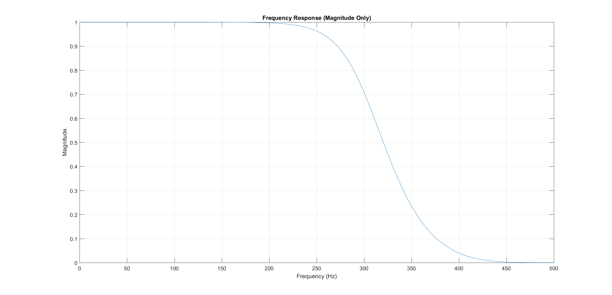
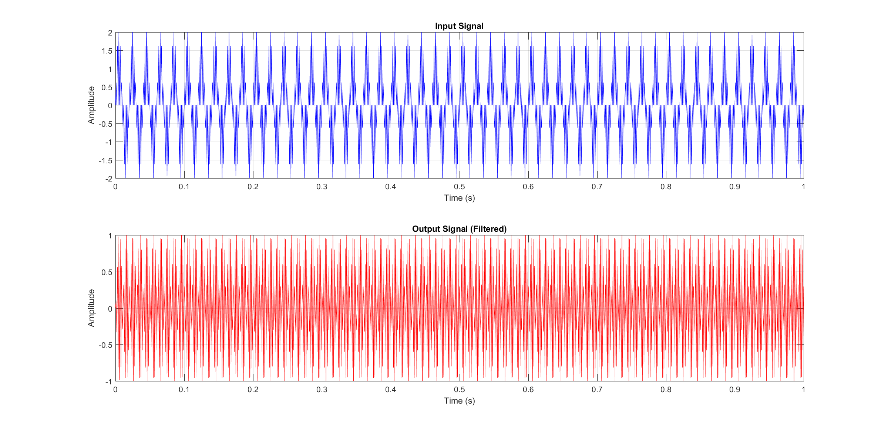
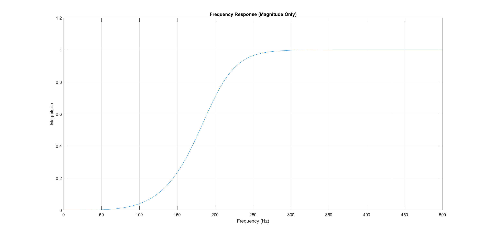
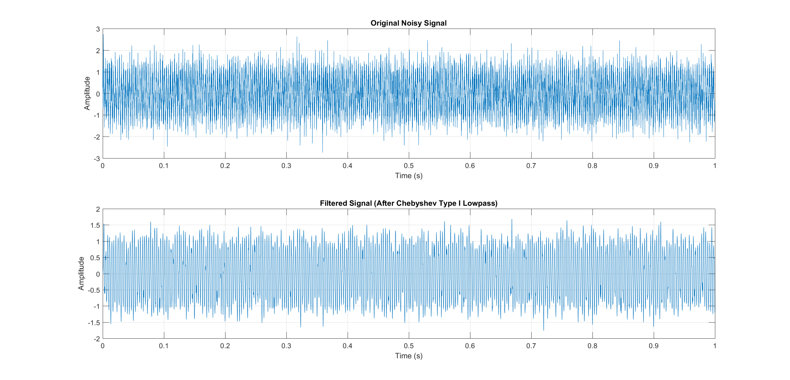
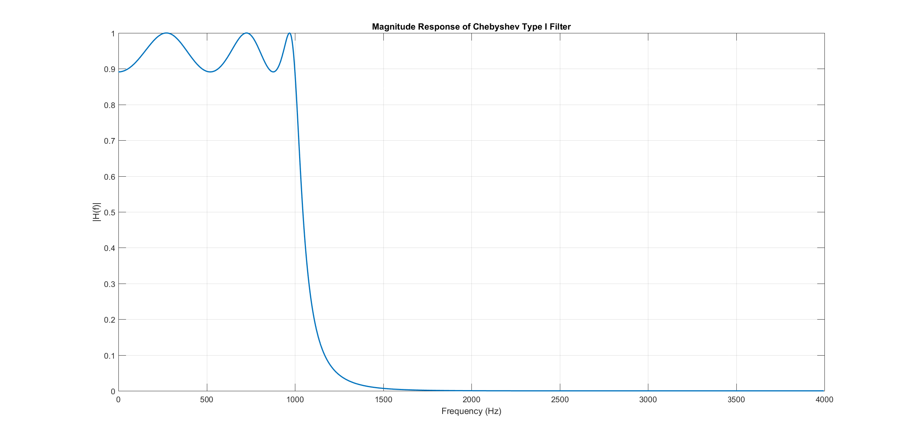

# Signal Processing Filters

Implementation of digital filters using MATLAB, covering Butterworth and Chebyshev Type I designs for Low-Pass and High-Pass filtering applications.

---

## Project Structure

```
signal-processing-filters/
├── code/
│   ├── low_pass_filter.m
│   ├── high_pass_filter.m
│   └── chebyshev_lpf.m
├── plots/
│   ├── lpf_input_output_original.png
│   ├── lpf_input_output_filtered.png
│   ├── lpf_frequency_response.png
│   ├── hpf_input_output.png
│   ├── hpf_frequency_response.png
│   ├── cheby_signals.png
│   └── cheby_frequency_response.png
└── README.md
```

---

## Filters

### 1. Butterworth Low-Pass Filter

A 4th order Butterworth low-pass filter designed to pass frequencies below 300 Hz and attenuate frequencies above the cutoff.

| Parameter | Value |
|-----------|-------|
| Filter Type | Butterworth |
| Sampling Frequency | 1000 Hz |
| Cutoff Frequency | 300 Hz |
| Filter Order | 4 |

Input signal contains 50 Hz and 450 Hz components. After filtering, the 50 Hz component passes through while the 450 Hz component is attenuated.

**Input vs Output Signal**



**Frequency Response**



---

### 2. Butterworth High-Pass Filter

A 4th order Butterworth high-pass filter designed to pass frequencies above 200 Hz and attenuate frequencies below the cutoff.

| Parameter | Value |
|-----------|-------|
| Filter Type | Butterworth |
| Sampling Frequency | 1000 Hz |
| Cutoff Frequency | 200 Hz |
| Filter Order | 4 |

Input signal contains 50 Hz and 450 Hz components. After filtering, the 450 Hz component passes through while the 50 Hz component is attenuated.

**Input vs Output Signal**



**Frequency Response**



---

### 3. Chebyshev Type I Low-Pass Filter

A Chebyshev Type I low-pass filter with automatic order selection. Unlike Butterworth, Chebyshev filters allow ripple in the passband in exchange for a sharper rolloff at the cutoff frequency.

| Parameter | Value |
|-----------|-------|
| Filter Type | Chebyshev Type I |
| Sampling Frequency | 8000 Hz |
| Passband Edge | 1000 Hz |
| Stopband Edge | 1500 Hz |
| Passband Ripple | 1 dB |
| Stopband Attenuation | 40 dB |
| Filter Order (auto) | 6 |

The filter order is calculated automatically using `cheb1ord` based on the design specifications. A noisy 300 Hz sine wave is used to demonstrate noise reduction performance.

**Noisy vs Filtered Signal**



**Frequency Response**



---

## Requirements

- MATLAB R2016b or later
- Signal Processing Toolbox

## How to Run

1. Open MATLAB
2. Navigate to the `code/` folder
3. Run any of the `.m` files
4. Output figures will appear automatically

---

## Author

**Karim Ahmed**  
Communication and Electronics Engineering, HTI Egypt  
CCNA Certified  
GitHub: [karimahmedd66](https://github.com/karimahmedd66)
